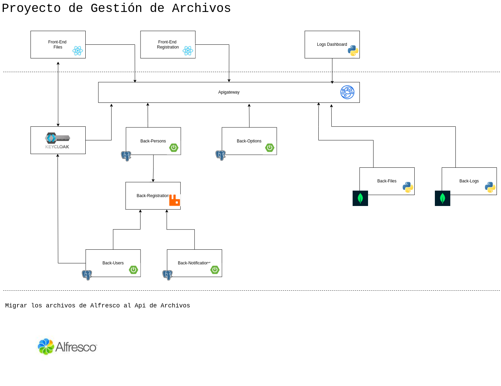

# API de Gestión de Archivos — Arquitectura Modular con FastAPI, MongoDB y React
¿Y si pudiéramos construir un sistema moderno, flexible y escalable para gestionar archivos, con una arquitectura pensada desde cero para microservicios? Este proyecto nace con ese objetivo: combinar lo mejor del ecosistema web moderno para crear una solución robusta y extensible que permita almacenar, visualizar y administrar archivos de forma eficiente.

## ¿Qué es este proyecto?
Es una plataforma para la gestión de archivos que aprovecha tecnologías punteras como MongoDB, FastAPI y React. Su objetivo es proporcionar una base sólida para construir un sistema distribuido orientado a microservicios, donde cada componente pueda escalar de manera independiente.

La arquitectura está diseñada para ser simple al inicio, pero con la capacidad de crecer hacia un ecosistema más complejo en el que se puedan incorporar nuevas funcionalidades y servicios en paralelo, escalable, segura y fácil de mantener, haciendo uso de colaboración entre servicios mediante colas de mensajes, un API Gateway para centralizar el acceso y herramientas de Identity and Access Management (IAM) para controlar la autenticación y autorización de los usuarios.

## MongoDB

Base de datos NoSQL ideal para almacenar rutas de archivos y metadatos (tipo, tamaño, fecha de creación, etc.)
Modelo de documentos flexible que facilita el manejo y expansión del esquema.

## FastAPI

Backend de alto rendimiento para construir APIs RESTful.
Validación automática, documentación integrada y facilidad para implementar operaciones CRUD sobre los datos.
Ideal para arquitecturas basadas en microservicios gracias a su rapidez de desarrollo y despliegue.

## React

Es una biblioteca popular para construir interfaces de usuario interactivas. Permite crear componentes reutilizables que pueden comunicarse fácilmente con el backend a través de solicitudes HTTP. Puedes diseñar formularios para cargar archivos, visualizar listas de archivos y permitir acciones como la descarga o eliminación.

## Almacenamiento de Archivos

Guardar los archivos comprimidos en el disco duro del servidor es una práctica común. Esto puede hacerse utilizando bibliotecas como os en Python. Considera utilizar herramientas como gzip o zip para reducir el tamaño de los archivos antes de almacenarlos

## Seguridad 

Implementar autenticación y autorización acceso a la API y los archivos almacenados.

## Errores

Asegúrate de implementar un manejo adecuado de errores tanto en el backend como en el frontend para mejorar la experiencia del usuario.

# ¿Por qué Colaborar?

Participarás en un proyecto real de microservicios con herramientas modernas del ecosistema DevOps y desarrollo web.
Aprenderás buenas prácticas de diseño de sistemas distribuidos.
Colaborarás con una comunidad técnica comprometida y con visión a futuro.
¡Tu contribución será reconocida y valorada!

## ¿Cómo Empezar?

Clona el repositorio:
    git clone https://github.com/emontenegrop/react-fastapi-mongo.git
Levanta los servicios con Docker:
    docker-compose up --build
Accede al panel de administración o frontend en:
    http://localhost:3000

## Contacto y Contribuciones
¿Te interesa colaborar o aportar ideas? ¡Estás más que bienvenido!
Abre un issue con tus dudas o sugerencias.
Haz un fork y envía tu pull request.

Escríbenos por correo o en el canal de Discord del proyecto. https://discord.gg/3XvBUDcp

